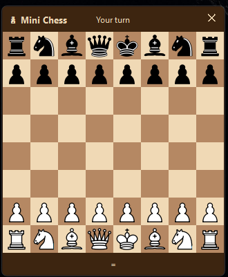

# ♟️ Mini Chess

A minimalist, floating desktop chess application for Windows. Play against bots at different ELO levels directly from your system tray.



>[!info]
> This project is a work in progress, made (mostly) with an AI agent.

## Features

-   **Floating Desktop Widget**: A frameless, always-on-top chessboard that lives on your desktop.
-   **System Tray Integration**: Control everything from the taskbar icon (Show/Hide, New Game, Difficulty, Sides).
-   **Stockfish Engine**: Powered by the world-class Stockfish engine with calibrated ELO levels (400 to 2500).
-   **Play as White or Black**: Toggle your side anytime; the board and coordinates flip automatically.
-   **Resizable**: Choose between Small, Medium, and Large board presets.
-   **Human-like Feel**: Artificial "thinking" delay makes the bot feel less like a machine.
-   **Capture Tracking**: See taken pieces and material score at a glance.
-   **Modern UI**: Classic wood-style theme with SVG pieces for crisp rendering.
-   **Auto-Setup**: Automatically downloads Stockfish and high-quality chess pieces on first run.

## Tech Stack

-   **Python 3.11+**
-   **PySide6 (Qt6)**: For the high-performance, transparent GUI.
-   **python-chess**: For move validation and engine communication.
-   **Stockfish**: The chess engine backend.
-   **pystray**: For the system tray integration.
-   **uv**: For fast and modern dependency management.

## Installation

### 1. Prerequisites
Ensure you have [uv](https://github.com/astral-sh/uv) installed.

### 2. Clone and Setup
```bash
git clone https://github.com/josuantonsanz/mini-chess.git
cd mini-chess
uv sync
```

### 3. Run the App
```bash
uv run minichess
```
*Note: On the first launch, the app will ask to download the Stockfish engine (~50MB) and chess pieces. This is a one-time setup.*

## Controls

-   **Drag Board**: Click and hold anywhere on the board to move the window.
-   **Move Piece**: Click a piece to select it, then click a target square (valid moves are highlighted with dots).
-   **Tray Icon (Right-Click)**:
    -   `Show/Hide`: Toggle window visibility.
    -   `New Game vs Bot`: Start a new game at a specific ELO level.
    -   `Play as side`: Choose White or Black.
    -   `Board size`: Change window dimensions.
    -   `Quit`: Close the application.

## Project Structure

-   `src/minichess/main.py`: Entry point and application bootstrap.
-   `src/minichess/game.py`: Chess logic and state management.
-   `src/minichess/engine.py`: Stockfish wrapper and ELO configuration.
-   `src/minichess/ui/`: All PySide6 GUI components.
-   `src/minichess/tray.py`: System tray menu and icon logic.

## License
MIT
